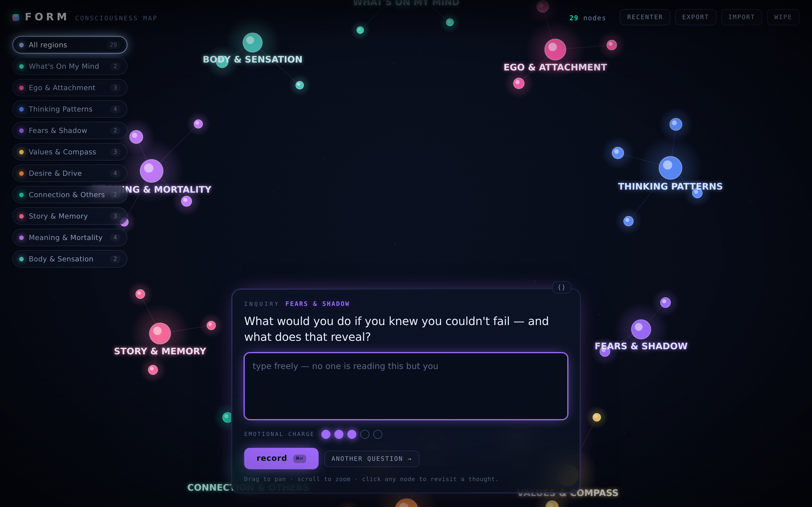

# FORM — a consciousness map

A private instrument for mapping how your mind works. It asks you deep,
recursive questions — about your ego attachments, your thinking patterns, your
fears, your values — and turns every answer into a glowing node in a living
constellation you can pan, zoom, and poke through.

It is deliberately **not** a chat-bubble AI website. It's a dark neural
interface: a starfield, neon regions of mind, and thought-bubbles that orbit
the part of you they belong to.



## What it does

- **Constant inquiry.** A composer always sits at the bottom, asking the next
  question. Answer it, hit *record*, and it immediately serves another. Some
  answers trigger a deeper follow-up.
- **114 questions across 10 regions of mind:**
  *What's On My Mind · Ego & Attachment · Thinking Patterns · Fears & Shadow ·
  Values & Compass · Desire & Drive · Connection & Others · Story & Memory ·
  Meaning & Mortality · Body & Sensation.*
- **A real visualization.** Each reflection becomes a node, sized by how much
  you wrote and how charged it is, orbiting its region's hub in a
  force-directed field. Click any node to revisit the thought; drag nodes and
  the map around; scroll to zoom.
- **Emotional charge.** Rate each answer 1–5; higher charge pulls the node
  tighter into its region and makes it burn brighter.
- **Filter by region.** Use the left rail to focus inquiry on one part of your
  mind, or roam across all of them.

## Privacy

Everything lives in your browser's `localStorage` on this device. There is no
server, no account, no telemetry — nothing leaves your machine. Use **export**
to save a backup file, **import** to restore it, **wipe** to erase everything.

(The only network call is to Google Fonts for the interface typeface; if it's
blocked, the app falls back to a system font and works exactly the same.)

## Running it

**Live:** https://jaredlawler.github.io/form/ — deployed automatically by
GitHub Actions on every push (see `.github/workflows/deploy.yml`).

**On your phone:** open the link above, then *Add to Home Screen*
(Share menu on iOS Safari, browser menu on Android Chrome). It installs as a
fullscreen app with its own icon and works offline.

**Locally:** no build step, no dependencies. Either:

```bash
# just open the file
open index.html        # macOS  (or: xdg-open index.html on Linux)

# …or serve it locally
python3 -m http.server 8000
# then visit http://localhost:8000
```

Note: your map lives in each device's local storage, so phone and laptop keep
separate maps. Use **export** on one device and **import** on the other to
carry it across.

## Files

```
index.html        structure + HUD
css/style.css     the neural-interface aesthetic
js/questions.js   the question bank (regions, prompts, follow-ups)
js/storage.js     localStorage persistence + tag extraction
js/graph.js       the force-directed constellation (canvas)
js/app.js         the conductor: inquiry flow + UI wiring
```

## Make it yours

Add or edit questions in `js/questions.js` — each region is just a list of
prompts and optional `followups`. Add a whole new region by appending another
object to `DIMENSIONS` with an `id`, `label`, `color`, `blurb`, and
`questions`; the map picks it up automatically.
